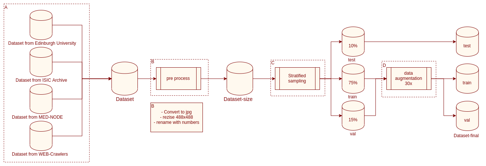

# TCC 1 UnB
## Universidade de Brasília - UnB
## Faculdade UnB Gama - FGA
## Electronic Engineering

### XAI techniques applied on convolutional neural network for skin lesion classification - First phase
#### Author: João Vitor Rodrigues Baptista
#### Advisor: Dr. Nilton Correia da Silva

## Usage 
This is a academic project so if you want to replicate or use any code. Just cite this work.

```
@misc{jvrbaptista,
  author = {Baptista, João and Silva, Nilton},
  title = {XAI techniques applied on convolutional neural network for skin lesion classification},
  year = {2019},
  publisher = {GitHub},
  journal = {GitHub repository},
  howpublished = {\url{https://github.com/helpthx/TCC-1-UnB}},
}
```
## How to replicate 

Just follow the steps write on the [paper](https://github.com/helpthx/TCC-1-UnB/tree/master/text)

Follow this pipeline with the notebooks provide above.



