# Experiment 7
## Results
### 4.1 Dataset

Moreover, the dataset was divided into three separated directo-
ries following the division of 10%, 15%, and 75% for testing, evaluation, and training, respectively in stratified way, using a python lib with seed parameters equal 12345.
The training and evaluation dataset was augmented,  by a factor of 30 times. The testing dataset did not suffer any transformations in order to avoid wasting time processing.
Furthermore, the final numbers for the datasets can be seen in table 1.

##### Table 1– Images's number used in the dataset for the this experiment.

| Dataset                   | train | val   | test |
|---------------------------|-------|-------|------|
| actinic-keratosis         | 4278  | 837   | 20   |
| basal-cell-carcinoma      | 18720 | 3844  | 84   |
| dermatofibroma            | 4774  | 930   | 22   |
| hemangioma                | 3999  | 775   | 19   |
| intraepithelial-carcinoma | 3441  | 682   | 15   |
| malignant-melanoma        | 15965 | 3193  | 69   |
| melanocytic-nevus         | 11656 | 2325  | 51   |
| pyogenic-granuloma        | 2263  | 434   | 11   |
| squamous-cell-carcinoma   | 9672  | 1922  | 43   |
| Total                     | 74768 | 14942 | 334  |

###  Infrastructure for training and testing 
The experiment were conducted under the google colab environment, that consisted of Linux version 4.14.137+ (chrome-bot@chromeos-legacy-release-us-central1-b-x32-44-v3dn) (gcc version 4.9.x 20150123 (prerelease) running PyTorch framework and other python's data manipulation libs.

[PyTorch](https://pytorch.org/) - **1.3.1**

[Torchvision](https://pytorch.org/) - **0.4.2**

```
[name: "/device:CPU:0" 
device_type: "CPU" 
memory_limit: 268435456 
locality { } 

incarnation: 10575003407439260273, 
name: "/
device:XLA_CPU:0" 
device_type: "XLA_CPU" 
memory_limit: 17179869184 
locality { } 

incarnation: 12607010922076994446 
physical_device_desc: "
device: XLA_CPU device", 
name: "/
device:XLA_GPU:0" 
device_type: "XLA_GPU" 
memory_limit: 17179869184 
locality { } 

incarnation: 15083069251257245813 
physical_device_desc: "
device: XLA_GPU device", 
name: "/
device:GPU:0" 
device_type: "GPU" 
memory_limit: 15956161332 
locality { bus_id: 1 links { } } 
incarnation: 7574273019028501897 
physical_device_desc: "
device: 0, 
name: Tesla P100-PCIE-16GB, pci bus id: 0000:00:04.0, compute capability: 6.0"]
``` 

### 4.3 Classification

The best results achieved on this experiment were with the use of the ResNet-152 architecture, trained over an augmented dataset with a mixture of MED-NODE, Edinburgh and Atlas datasets. The augmentation made was of 30x for each class, leaving the classes unbalanced.

Furthermore, the ResNet architecture had to be modified to accommodate the needs of the problem at hand. So, the last layer of the architecture was changed from 1,000 classes to 9 classes, the 9 skin lesions. 

#### 4.3.1 Training process
Moreover, the technique of transfer learning was applied to generate the best results more rapidly. For that, the hyperparameters of the network had to be tuned and carefully set, for that same purpose.

##### 4.3.1.1 Hyperparameters
• batch_size: This hyperparameter sets the number of examples that will be saved in memory to be processed by the neural network in the same forward pass. Thus the limiter of this value is mainly hardware (GPU memory or Random Access Memory capacity). For the infrastructure used in this work the limit of parallel images load, alongside the weights of the ResNet-152, was 32 images.
# 
Optimizer parameters: Stochastic gradient descent (optionally with momentum)
• base_lr: This is the start learning rate set for the network, used by the optimizers to update the learnable weights. For the experiment was used a start learning rate of 0.01.
• momentum: 0.9
• weight_decay=0.00001
• step_size=1
• gamma=0.1 

##### 4.3.1.2 Model Training
For the training process, it was used the technique of transfer learning with the approach of fine-tuning the network. Thus, it was necessary to gather the ResNet-152 pre-trained weights for the ImageNet dataset first, and then modify the network for the purpose of this work.
Finally, the model used in the testing phase was the product of the epoch number 34. This training phase took an uninterrupted total time of 12 hours .

### 4.3.2 Results
The results can be find on the notebook [7_test_model_exp_1.ipynb](https://github.com/helpthx/TCC-1-UnB/blob/master/exp-7/7_test_model_exp7.ipynb "7_test_model_exp_7.ipynb"). But overall metrics were:
F1 score: 0.741553
Accuracy score: 0.784431

Example:
Predict with the trained model:

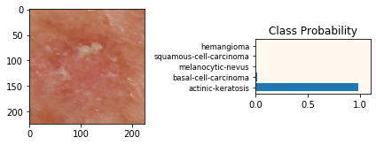

The model predict well with high confidence


### Mapping skin lession with the real class label for the model

 Lession name              | Class |
|---------------------------|-------|
| actinic-keratosis         | 0     |
| basal-cell-carcinoma      | 1    |
| dermatofibroma            | 2     |
| hemangioma                | 3    |
| intraepithelial-carcinoma | 4     |
| malignant-melanoma        | 5     |
| melanocytic-nevus         | 6     |
| pyogenic-granuloma        | 7     |
| squamous-cell-carcinoma   | 8     |

Here is the confusion matrix for the current model:

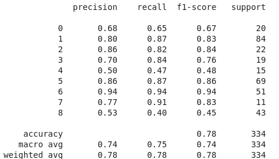

### Final metrics for each class

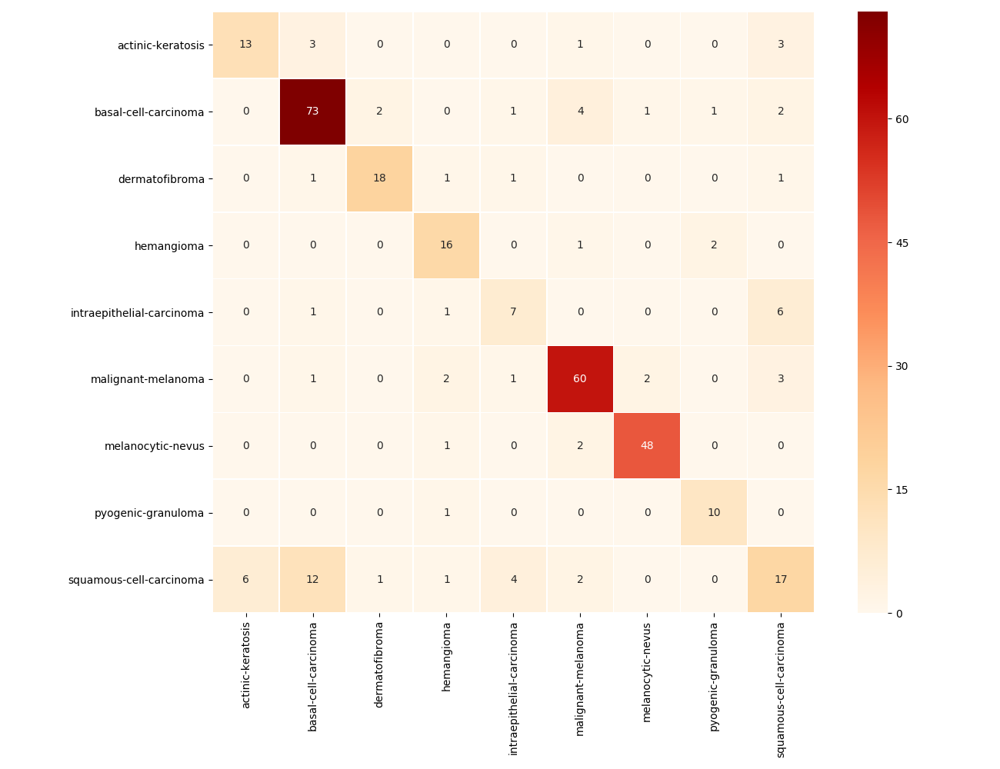

### ROC analsis for some labels

#### ROC for actinic-keratosis
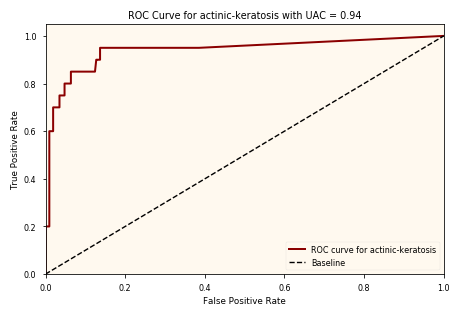

#### ROC for basal-cell-carcinoma
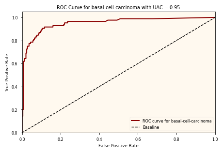

#### ROC for dermatofibroma
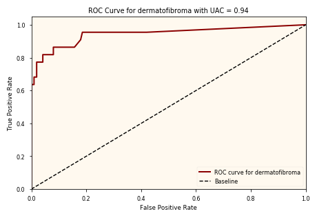

#### ROC for hemangioma
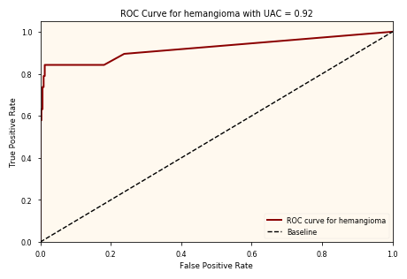

#### ROC for intraepithelial-carcinoma
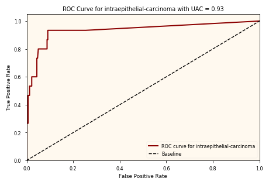

#### ROC for malignant-melanoma
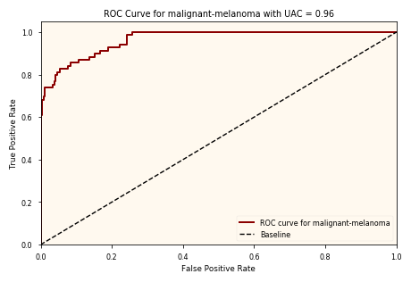

#### ROC for melanocytic-nevus
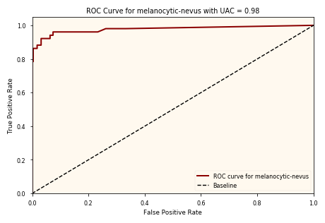

#### ROC for pyogenic-granuloma
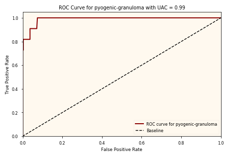

#### ROC for pyogenic-granuloma
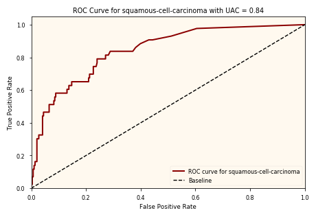
